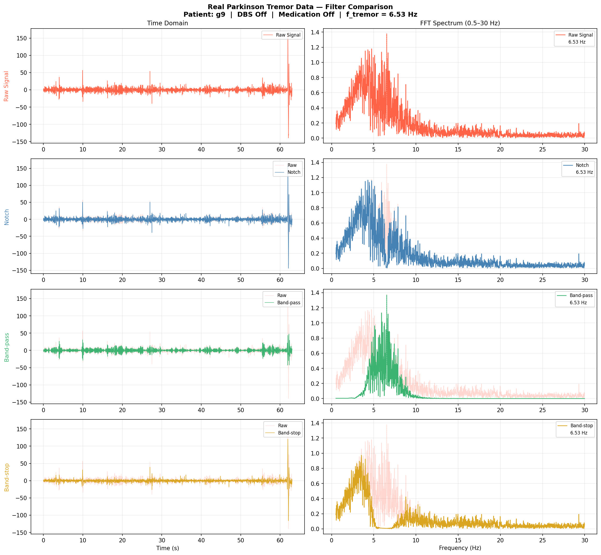

# Parkinson's Tremor — Real Data Filter Analysis

DSP pipeline applied to real Parkinson's patient EMG data from PhysioNet.
Tremor frequency automatically detected via FFT, then suppressed using three IIR Biquad filter topologies.

Gerçek Parkinson hastası EMG verisine uygulanan DSP pipeline. Tremor frekansı FFT ile otomatik tespit edilmiş, ardından üç farklı IIR Biquad filtresi ile bastırılmıştır.

---

## Dataset / Veri Seti

| | |
|---|---|
| **Source / Kaynak** | PhysioNet Tremor Database (tremordb 1.0.0) |
| **Patient / Hasta** | g9 — DBS off, medication off, right hand |
| **Sampling rate / Örnekleme hızı** | 100 Hz |
| **Detected tremor frequency / Tespit edilen tremor frekansı** | 6.53 Hz |

---

## Filters & Results / Filtreler ve Sonuçlar

| Filter / Filtre | Attenuation / Bastırma | Signal Preservation / Sinyal Koruma | Status / Durum |
|--------|-------------|---------------------|--------|
| Notch (Q=15) | -36.0 dB | 99.5% | ✅ Effective / Etkili |
| Band-pass | -0.1 dB | 3.8% | ❌ Isolation only / Sadece izolasyon |
| Band-stop | -45.3 dB | 78.3% | ✅ Effective / Etkili |

> **Best result / En iyi sonuç:** Notch filter @ 6.53 Hz — highest signal preservation with strong attenuation. / En yüksek sinyal koruma ile güçlü bastırma.

---

## Output / Çıktı



### How to read the plot / Grafik nasıl okunur

The output figure contains **4 rows × 2 columns** of panels.
Çıktı görseli **4 satır × 2 sütun** panelden oluşmaktadır.

**Left column / Sol sütun — Time Domain / Zaman Domeninde:**

| Row / Satır | Content / İçerik |
|-------------|-----------------|
| Row 1 / 1. Satır | Raw signal — unfiltered tremor + noise / Ham sinyal — filtrelenmemiş tremor + gürültü |
| Row 2 / 2. Satır | Notch filter output — tremor peak removed, rest preserved / Notch filtre çıktısı — tremor tepe noktası kaldırıldı, gerisi korundu |
| Row 3 / 3. Satır | Band-pass output — only tremor band remains / Band-pass çıktısı — sadece tremor bandı kaldı |
| Row 4 / 4. Satır | Band-stop output — tremor band removed, rest passes / Band-stop çıktısı — tremor bandı kaldırıldı, gerisi geçti |

**Right column / Sağ sütun — FFT Spectrum / FFT Spektrumu:**

| Row / Satır | Content / İçerik |
|-------------|-----------------|
| Row 1 / 1. Satır | Raw spectrum — dominant peak visible at 6.53 Hz / Ham spektrum — 6.53 Hz'de baskın tepe görünür |
| Row 2 / 2. Satır | Notch spectrum — 6.53 Hz peak eliminated / Notch spektrumu — 6.53 Hz tepesi yok edildi |
| Row 3 / 3. Satır | Band-pass spectrum — only 4.53–8.53 Hz band visible / Band-pass spektrumu — sadece 4.53–8.53 Hz bandı görünür |
| Row 4 / 4. Satır | Band-stop spectrum — 4.53–8.53 Hz band suppressed / Band-stop spektrumu — 4.53–8.53 Hz bandı bastırıldı |

> **Dashed white line / Kesik beyaz çizgi:** marks the detected tremor frequency (6.53 Hz) on all FFT plots. / Tüm FFT grafiklerinde tespit edilen tremor frekansını (6.53 Hz) gösterir.

> **Gray background signal / Gri arka plan sinyali:** raw signal shown for comparison in filtered rows. / Filtrelenmiş satırlarda karşılaştırma için ham sinyal gösterilir.

---

## Files / Dosyalar

| File / Dosya | Description / Açıklama |
|------|-------------|
| `real_tremor.py` | Main script — FFT detection, filter design, metrics, visualization / Ana kod — FFT tespiti, filtre tasarımı, metrikler, görselleştirme |
| `g9r15of.rit` | Raw EMG recording from PhysioNet / PhysioNet'ten ham EMG kaydı |
| `real_data_filter_comparison.png` | 4×2 panel filter comparison plot / 4×2 panel filtre karşılaştırma grafiği |

---

## Usage / Kullanım
```bash
pip install numpy scipy matplotlib wfdb
python real_tremor.py
```

---

## Reference / Kaynak

Rivlin-Etzion M, et al. (2006). Effect of Deep Brain Stimulation on Parkinsonian Tremor.
PhysioNet. https://physionet.org/content/tremordb/
